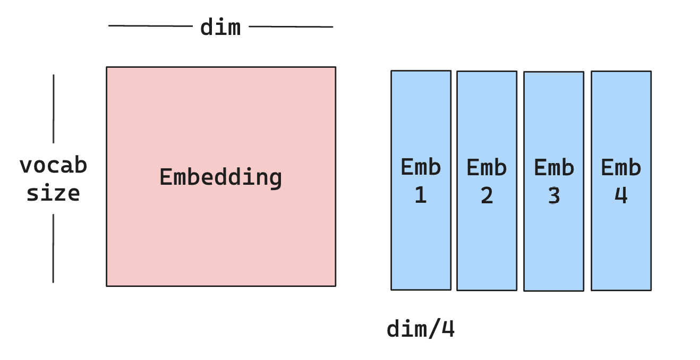
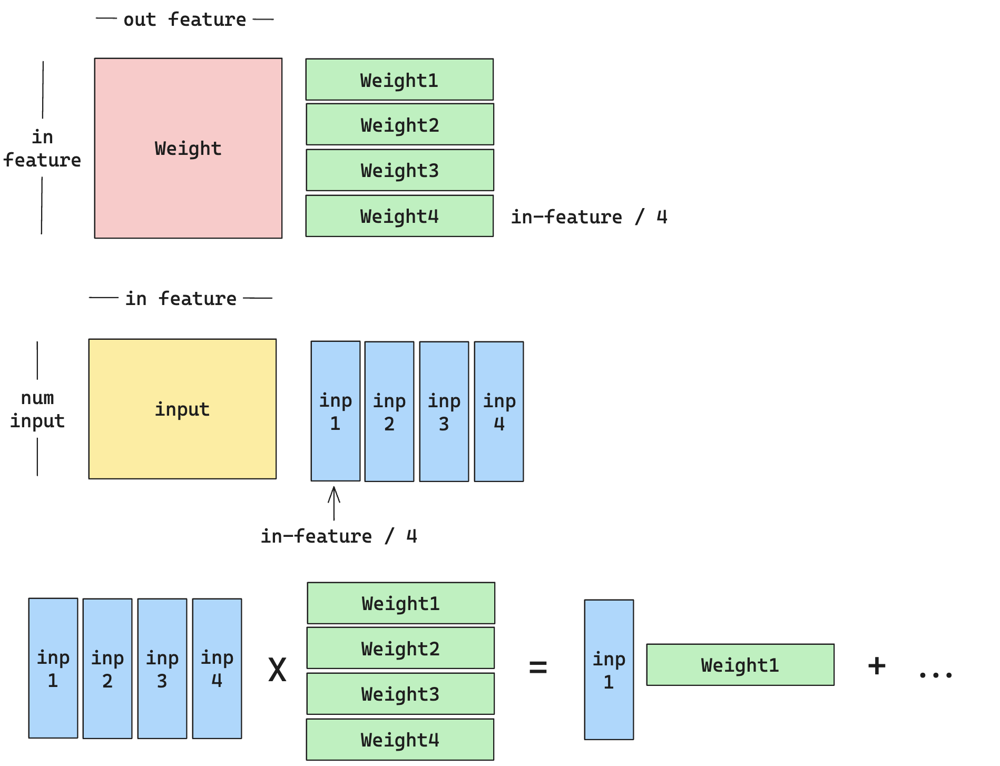

# FairScale

FairScale is a PyTorch extension library for high performance and large scale training.

## What is FairScale?

FairScale 是 facebook-research 在 [Github](https://github.com/facebookresearch/fairscale/tree/main) 上开源，用于 PyTorch 高性能和大规模训练的拓展库。

根据 Github 及其文档主页可以发现 FairScale 的更新与维护已处于半搁置状态了。他对于主流的一些分布式训练优化特性都进行了集成，诸如：ZeRO Stage 1/2/3，在 FairScale 中分别对应为：Optim State Sharding (OSS)，Sharded DDP，Fully Sharded Data Parallel (FSDP)。同时 FairScale 也支持诸如：[pipeline parallelism](https://arxiv.org/pdf/1811.06965) (流水线并行), model parallelism (模型并行) 等常见功能。

FairScale 内容众多，全部讲解既不可能也没意义，本文档旨在介绍 FairScale 在 Llama 中的应用，减少大家在阅读源码时可能对 FairScale 产生的困惑。

## FairScale in Llama2.

首先统计 FairScale 在 Llama 中的具体应用，发现主要分为两个部分：1）模型并行初始化；2）支持模型并行的组件（Layer）。

在 `generation.py` 中，主要是 `Llama.build` 函数中涉及到的模型并行初始化。

```python
from fairscale.nn.model_parallel.initialize import (
    get_model_parallel_rank,
    initialize_model_parallel,
    model_parallel_is_initialized,
)
```

在 `model.py` 中，主要是使用支持模型并行的组件参与模型的构建。

```python
import fairscale.nn.model_parallel.initialize as fs_init
...
from fairscale.nn.model_parallel.layers import (
    ColumnParallelLinear,
    ParallelEmbedding,
    RowParallelLinear,
)
...
# Used in the Attention model.
fs_init.get_model_parallel_world_size()
```

接下来我将一步步介绍上述代码的作用。显然，我们可以分成两个模块：`model_parallel.initialize` 和 `model_parallel.layers`。由于官方文档并没有 `model_parallel` 相关的更新， 以下内容主要基于 Fair Scale 的 source code 及对其 comments 的理解。

### `fairscale.nn.model_parallel.initialize`

*Function* `initialize_model_parallel` 

- **目的**：完成模型并行的初始化工作。
- **功能实现**：多次调用 `torch.distributed.new_group` 来创建不同并行（模型并行，流水线并行，数据并行等）对应的通信组，并更新类似于：`_MODEL_PARALLEL_GROUP` 等变量。
- **例子**：假设我们有 8 个 GPU 分别用 `g0 ... g7` 表示，当 `model_parallel_size = 2` 时，我们会得到 4 个不同的模型并行 Group：`[g0, g1], [g2, g3], [g4, g5], [g6, g7]`。 

> **Q：为什么要使用 `torch.distributed.new_group` 这个函数呢？**
>
> **A：**默认情况下，集体通信操作作用于默认组(常称为 world)，并要求**所有进程**都进入分布式函数调用。然而，一些通信也许只对部分进程有价值，所以创建新的组并只在新的组内进行通信会更有效率。

*Function* `model_parallel_is_initialized`

- **目的**：检查模型并行的初始化工作是否完成。
- **功能实现**：检查 `_MODEL_PARALLEL_GROUP`，`_DATA_PARALLEL_GROUP` 等变量是否被更新。

*Function* `get_model_parallel_world_size`

- **目的**：返回当前模型并行 Group 的 world size（可以理解为总进程数）。

*Function* `get_model_parallel_rank`

- **目的**：返回当前模型并行 Group 的 rank （可以理解为进程在当前 Group 中的编号）。

### `fairscale.nn.model_parallel.layers`

*Class* `ParallelEmbedding`

- **功能**：在 embedding 维度进行并行化。（注意是 embedding 维度而非 vocab 维度）

举例说明，假设 `vocab_size = 1000`，`dim = 1024`，`model_parallel_size = 4`，那么每个 GPU 将会被分配到一个 `[1000, 256]` 规模的 Embedding，而非 `[250, 1024]` 规模的 Embedding。



*Class* `ColumnParallelLinear`

**功能**：按列去切分（并行）线性层参数。例如，线性层可以被定义为 $Y = X A + b$ ，我们将 $A$ 沿着**列**进行切分（并行化），即 $A = [A_1, \ldots, A_M]$ （其中 $M$ 代表模型并行数）。

其可视化与 ParallelEmbedding 相同，可以参考上图进行理解。

*Class* `RowParallelLinear`

**功能**：按**行**去切分（并行）线性层参数。例如，线性层可以被定义为 $Y = X A + b$ ，我们将 $A$ 沿着**行**进行切分，**同时，输入 $X$ 则需要沿着列进行切分（显然，这样才能保证计算是能正确执行的）**。
$$
A = \begin{bmatrix} A_1 \\ \vdots  \\ A_M \end{bmatrix} \quad X = [X_1, \ldots, X_M]
$$
这里同样做了一个简单的示意图，包含了我们是如何切分 `weight` 和 `input`，帮助你理解 RowParallelLinear 是如何进行 `forward` 操作。



## Appendix A. 模型并行中的分布式通信

⏰ `30min`

Appendix A 旨在探索模型并行中的分布式通信问题。尤其是 `backward` 操作中的分布式通信通常会被大部分工程师/研究员忽略。其实我自己也困惑是否需要写这部分内容？是否会和大部分的博客一样写的过于晦涩？但是我觉得这种基础且重要的知识应该简洁与优美，重点在于我是否找到了合适的介绍角度。

前文中涉及的模型并行主要有两种范式：**Column** 和 **Row**。我们尝试通过图片来理解。在介绍过程中可能设计一些通信原语的使用（推荐我之前某篇文章的中的[附录A](https://zhuanlan.zhihu.com/p/663517415)）首先介绍 Column Parallel 范式：


- `forward` 分析：（从左往右）
  - 由于是在 Column 上进行并行， 所以得到的结果只是真正结果的一部分，需要一次 AllGather 操作进行合并。
- `backward` 分析：（从右往左）
  - 反向传播时，输入的 `Output Grad` 在不同 GPU 上是一致的，但是我们**只需要 `weight` 对应的部分**，所以**需要一次 Split 操作**。
  - 同时，由于是按 Column 进行划分，对应的参数相当于独立更新了每个 `Input`，**这就意味着在不同的 GPU 上此时 `Input Grad` 各不相同**，显然我们是要保证输出的梯度是一致的，所以我们需要一次 AllReduce 操作保证输出梯度一致。（见图右）

然后我们尝试理解 Row Parallel 范式。在前文中我们用公式展示了 `Weight` 和 `Input` 是如何划分的，这里我们再给出一次：
$$
A = \begin{bmatrix} A_1 \\ \vdots  \\ A_M \end{bmatrix} \quad X = [X_1, \ldots, X_M]
$$
那么，最终的计算可以被简化为： $Y = XA + b = (X_1 A_1 + \ldots + X_MA_M) + b$​ 。


- `forward` 分析：（从左往右）
  - 由于 `Weight` 是在 Row 上进行并行（参考公式中的 $A$ ），所以 `Input` 需要按 Column 进行拆分（参考公式中的 $X$ ，否则无法完成计算），因此我们**需要一次 Split 操作**。这时候我们每个 GPU 上都存在对应的 $A_i$ 和 $X_i$ 。
  - 依据公式可知，当我们完成 GPU 内部的计算后，也就是得到 $X_iA_i$ 的结果后，我们需要一次**加总**操作，才能得到最终的输出 `Output`，这也**正对应着图中的 AllReduce 操作**。（通过图也可能发现，不同 GPU 上最开始得到的 Output 颜色不同）
- `backward` 分析：（从右往左）
  - 反向传播时，输入的 `Output Grad` 在不同 GPU 上是一致的，此时**我们并不需要像 Column Parallel 一样进行 Split**（思考下为什么）
  - 如下图右所示每个 GPU 上会计算得到 `Input Grad` 的一部分，我们最终需要一个 AllGather 操作将不同 GPU 上的 `Input Grad` 组合得到最终的输入梯度。

> **Q：为什么 Column Parallel 的 Output Grad 需要 Split 而 Row Parallel 的不需要？**
>
> **A：**这里其实设计到你是否理解 Linear 是如何进行反向传播的。假设：
>
> - `input` 是 $n \times d$ 的输入矩阵。
> - `weight` 是 $d \times m$ 的权重矩阵。
> - `output` 是 $n \times m$ 的输出矩阵。
> - `output_grad` 是输出的梯度，维度是 $n \times m$ 。
>
> 根据链式法则，权重的梯度 `weight_grad` 的计算过程是：
> $$
> \texttt{weight\_grad} = \texttt{input}^T \cdot \texttt{output\_grad}
> $$
>  输入的梯度 `input_grad` 的计算过程是：
> $$
> \texttt{input\_grad} = \texttt{output\_grad} \cdot \texttt{weight}^T
> $$
> 在 Column Parallel 中，`weight` 的维度是 $d \times (m/3)$，此时如果不拆分 `output_grad` 则无法完成 `input_grad` 的计算。
>
> 同理，为什么在 Row Parallel 中需要一次 AllGather 得到最终的 `input_grad`，是因为由于此时的 `weight` 维度是 $(d / 3) \times m$ ，那么计算得到的 `input_grad` 的维度是 $n \times (d / 3)$ ，我们需要 AllGather 不同 GPU 上的 `input_grad` 得到最终期望的 $n \times d$ 。

## Appendix B. 模型并行中 MLP/Attention 最优切分范式

⏰ `?min`

> 部分同学可能会比较好奇，为什么要同时用 ColumnParallelLinear 和 RowParallelLinear？只用一个不可以嘛？这样用的好处是什么？

这其实是基于目前主流的分布式模型训练框架 Megatron 的一篇 Paper: Megatron-LM （参考 References） 中的设计。

这个设计的优点很明显：**可以减少分布式计算中的一次不必要的同步通信**。但是展开讲需要很长的篇幅。

`[TODO]` 我认为可以等我的 Megatron-LM 的 Reading Report 完成后直接链接即可。

## References

- FairScale
  - [Repo](https://github.com/facebookresearch/fairscale/tree/main)
  - [Docs](https://fairscale.readthedocs.io/en/latest/)
- [Paper: GPipe: Easy Scaling with Micro-Batch Pipeline Parallelism](https://arxiv.org/pdf/1811.06965)
- [Paper: Megatron-LM: Training Multi-Billion Parameter Language Models Using Model Parallelism](https://arxiv.org/pdf/1909.08053)
- [Blog: ZeRO: Zero Redundancy Optimizer，一篇就够了。](https://zhuanlan.zhihu.com/p/663517415)