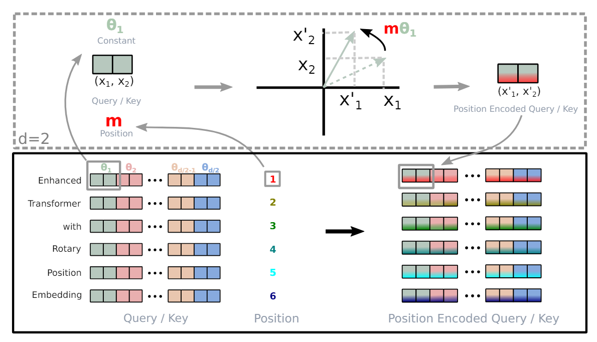

# RoPE
**RoPE** (Rotary Position Embedding, 旋转位置编码) 是一种能够将**相对位置信息**集成到 self-attention 中的一种位置编码方式。 Llama 也采用 RoPE 作为位置编码的方式。

## What is position encoding?

位置编码 (position encoding) 是指在 self-attention 计算 query, key, value 向量之前会对词嵌入向量 $x$ 加入位置信息，可以表示为：

$$
\begin{gather}
q_m = f_q(x_m, m) \\
k_n = f_k(x_n, n) \\
v_n = f_v(x_n, n)
\end{gather}
$$

其中 $q_m$ 表示第 $m$ 个 token 对应的词嵌入 $x_m$ 加入位置信息 $m$ 后得到的 query 向量。同理， $k_n, v_n$ 分别表示第 $n$ 个 token 对应的词嵌入 $x_n$ 加入位置信息 $n$ 后得到的 key 和 value 向量。

绝对位置编码 (absolute position encoding/embedding) 顾名思义就是将 token 的绝对位置信息编码进对应的 query, key, value 向量中，可以表示为：

$$
\begin{gather}
f_{t:t\in\{q, k, v\}} := W_{t:t\in\{q, k, v\}}(x_i + p_i)
\end{gather}
$$

其中 $x_i$ 为第 $i$ 个 token 对应的词嵌入，$p_i$ 为位置 $i$ 的位置编码， $W_{t:t \in \{q, k, v\}}$ 为 query, key, value 对应的变换矩阵。

相对位置编码 (relative position encoding/embedding) 则是在计算 query, key, value 向量时考虑 key, value 向量和 query 向量对应的 token 间的相对距离，可以表示为：

$$
\begin{gather}
f_q(x_m) := W_qx_m \\
f_k(x_n) := W_k(x_n + \tilde{p}\_{m-n}^{\ k}) \\
f_v(x_n) := W_v(x_n + \tilde{p}\_{m-n}^{\ v})
\end{gather}
$$

其中 $\tilde{p}\_{m-n}^{\ k}$ 和 $\tilde{p}\_{m-n}^{\ v}$ 表示计算 key, value 向量时可学习的相对位置编码。

我们使用 $q_m$ 和 $k_n$ 表示第 $m$ 和第 $n$ 个 token 对应的 query 向量和 key 向量。由于 self-attention 通过计算 $\langle q_m, k_n \rangle$ 来估计 token 之间的相关性，关于 value 向量的相对位置信息可以被忽略。

## What is RoPE

RoPE (旋转位置编码) 简单来说就是使用旋转矩阵对绝对位置进行编码，使 self-attention 计算 key 向量和 query 向量点乘时能显式地利用 token 间的相对位置关系。本文在此不做详细地求解过程和推导，这部分内容可以参考原作的论文和博客。

RoPE 的基本思想是 **通过绝对位置编码 (absolute position encoding) 的方式来实现相对位置编码 (relative position encoding)**。也就是说，RoPE 希望找到一种编码形式，通过对 query 向量和 key 向量进行绝对位置编码，使 query 向量和 key 向量的内积带有相对位置信息，即：

$$
\begin{gather}
\langle f_q(x_m, m), f_k(x_n, n) \rangle = g(x_m, x_n, m - n)
\end{gather}
$$

首先考虑向量维度为 2 的情形，RoPE 提出了一种满足上式的编码方式：

$$
\begin{gather}
f_q(x_m, m) = (W_qx_m)e^{im\theta} \\
f_k(x_n, n) = (W_kx_n)e^{im\theta} \\
g(x_m, x_n, m - n) = Re[(W_qx_m)(W_kx_n)^*e^{i(m - n)\theta}]
\end{gather}
$$

其中 $(W_kx_n)^\*$ 表示 $(W_kx_n)$ 的共轭复数，对于一个复数 $c = a + i\  b$, 其共轭复数表示为 $c^* = a - i\  b$， $Re$ 则表示复数的实部。为了方便理解，我们先做一些简单的标记。对于2维词嵌入 $x_m = [x_m^1 \\ x_m^2]$, 我们使用 $q_m= [q_m^1 \\ q_m^2]$ 来表示经过 query 变换的词嵌入。同样，我们使用 $k_n= [k_n^1 \\ k_n^2]$ 来表示经过 key 变换的词嵌入。根据欧拉公式 $e^{ix} = \cos x + i \sin x$, 我们将这些2维向量视作复数 (第 1 维视为复数的实部，第 2 维视为复数的虚部)，如 $q_m = q_m^1 + i\ q_m^2$, 将 RoPE 的位置编码方式展开：

$$
\begin{gather}
f_q(x_m, m) &=& (W_qx_m)e^{im\theta} \\
&=& (q_m^1 + i\ q_m^2)(\cos m\theta + i\ \sin m\theta) \\
&=& q_m^1\cos m\theta - q_m^2\sin m\theta + i\ q_m^1\sin m\theta + i\ q_m^2\cos m\theta
\end{gather}
$$

将复数结果重新视为向量，即将复数的实部作为向量的第 1 维，复数的虚部作为向量的第 2 维，可得

$$
\begin{gather}
f_q(x_m, m) &=& \begin{bmatrix} q_m^1\cos m\theta - q_m^2\sin m\theta \\\ q_m^1\sin m\theta + q_m^2\cos m\theta \end{bmatrix} \\
&=& \begin{bmatrix} \cos m\theta & -\sin m\theta \\\ \sin m\theta & \cos m\theta \end{bmatrix} \begin{bmatrix} q_m^1 \\ q_m^2 \end{bmatrix} \\
&=& R(m\theta)q_m
\end{gather}
$$

其中 $R(m\theta)$ 表示旋转角度为 $m\theta$ 的旋转矩阵，也就是说，我们可以将 RoPE 视为对经过 query, key 变换后的词嵌入做了一个角度由其位置决定的旋转变换，那么对于使用 RoPE 的 query 向量和 key 向量的内积，可以得到：

$$
\begin{gather}
\langle f_q(x_m, m), f_k(x_n, n)\rangle &=& \langle R(m\theta)q_m, R(n\theta)k_n \rangle \\
&=& (R(m\theta)q_m)^T(R(n\theta)k_n) \\
&=& q_m^TR^T(m\theta)R(n\theta)k_n \\
&=& q_m^TR^{-1}(m\theta)R(n\theta)k_n \\
&=& q_m^TR(-m\theta)R(n\theta)k_n \\
&=& q_m^TR((n-m)\theta)k_n \\
&=& \langle q_m,R((n-m)\theta) k_n \rangle
\end{gather}
$$

即，对于通过 RoPE 编码了绝对位置 $m, n$ 的 query 向量和 key 向量的内积相当于对 key 向量进行了对于 query 向量的相对位置编码。推导的过程使用了旋转矩阵的性质：

$$
\begin{gather}
R(a + b) = R(a)R(b), \qquad R^T(a) = R^{-1}(a)
\end{gather}
$$

最后，我们再推导一下上文提到的 RoPE 在向量维度为 2 的情形下的 query 向量和 key 向量内积的表达式:

$$
\begin{gather}
g(x_m, x_n, m - n) = Re[(W_qx_m)(W_kx_n)^*e^{i(m - n)\theta}]
\end{gather}
$$

为了理解方便，我们重新切换回二维向量的视角：

$$
\begin{gather}
g(x_m, x_n, m - n) &=& \langle f_q(x_m, m), f_k(x_n, n) \rangle \\
&=& \langle q_m,R((n-m)\theta) k_n \rangle
\end{gather}
$$

同样为了方便，我们做一个简化版本的展开：

$$
\begin{gather}
\langle q_m,R(\theta)k_n \rangle &=& \begin{bmatrix} q_m^1 & q_m^2 \end{bmatrix} \begin{bmatrix} \cos\theta & -\sin\theta \\\ \sin\theta & \cos\theta \end{bmatrix}  \begin{bmatrix} k_n^1 \\ k_n^2 \end{bmatrix} \\
&=& \begin{bmatrix} q_m^1 & q_m^2 \end{bmatrix} \begin{bmatrix} k_n^1\cos\theta - k_n^2\sin\theta \\\ k_n^1\sin\theta + k_n^2\cos\theta \end{bmatrix} \\
&=& q_m^1k_n^1\cos\theta - q_m^1k_n^2\sin\theta + q_m^2k_n^1\sin\theta + q_m^2k_n^2\cos\theta \\
Re[(W_qx_m)(W_kx_n)^*e^{-i\theta}] &=& Re[q_mk_n^*e^{-i\theta}] \\
&=& Re[(q_m^1 + i\ q_m^2)(k_n^1 - i\ k_n^2)(\cos\theta -i\ \sin\theta)] \\
&=& Re[(q_m^1k_n^1 + i\ (q_m^2k_n^1 - q_m^1k_n^2) + q_m^2k_n^2)(\cos\theta -i\ \sin\theta)] \\
&=& q_m^1k_n^1\cos\theta - q_m^1k_n^2\sin\theta + q_m^2k_n^1\sin\theta + q_m^2k_n^2\cos\theta
\end{gather}
$$

整理展开结果，我们得到一个关系:

$$
\begin{gather}
\langle q_m,R(\theta)k_n \rangle = Re[(W_qx_m)(W_kx_n)^*e^{-i\theta}]
\end{gather}
$$

那么，将 $\theta = (n - m)\theta$ 带入上述关系，就可以得到：

$$
\begin{gather}
g(x_m, x_n, m - n) &=& \langle q_m,R((n-m)\theta) k_n \rangle \\
&=& Re[(W_qx_m)(W_kx_n)^*e^{i(m - n)\theta}]
\end{gather}
$$

我们介绍完了向量维度 $d=2$ 的情形下 RoPE 的编码操作。对于向量维度 $d > 2$ 且为偶数的情形，RoPE 将 query 向量和 key 向量的元素两两一组分组，对每一组两个元素构成的向量执行如上文所述的旋转操作，对每一个分组，选取不同的 $\theta_i = 10000^{-2i/d}$ 作为旋转位置编码的基。这一过程可以参考论文的原图:

<!-- ## Why RoPE? -->

## Reference
- [Paper: ROFORMER: ENHANCED TRANSFORMER WITH ROTARY POSITION EMBEDDING](https://arxiv.org/pdf/2104.09864.pdf)
- [Blog: Transformer升级之路：2、博采众长的旋转式位置编码](https://kexue.fm/archives/8265)
